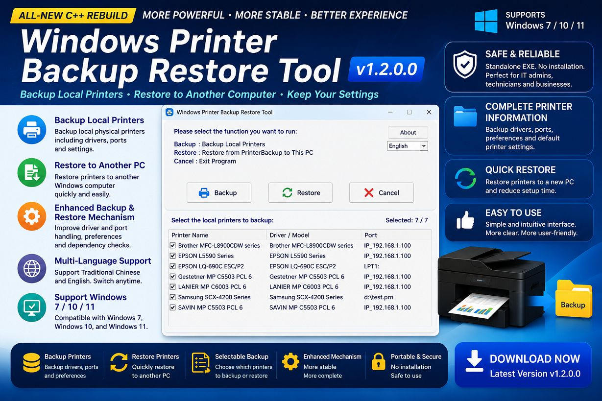
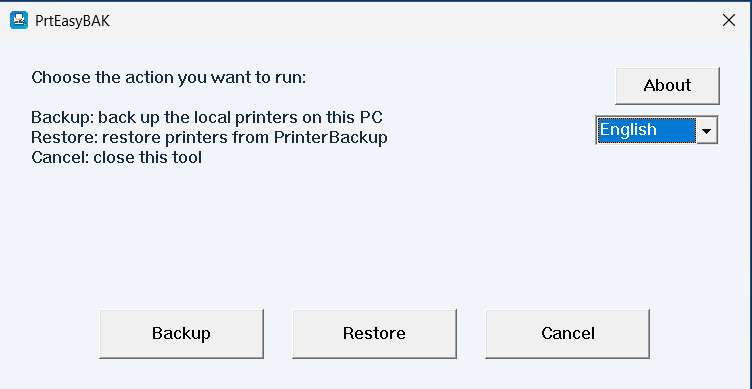
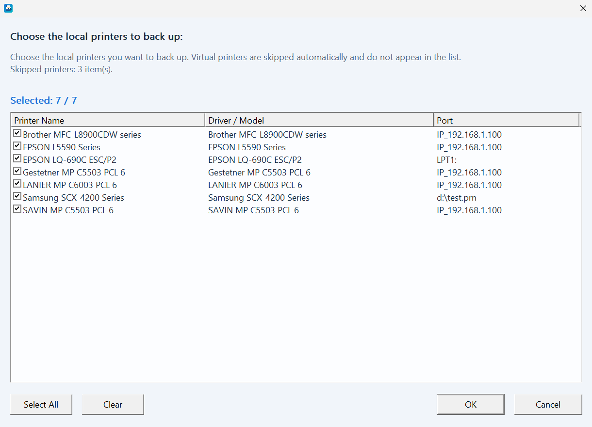
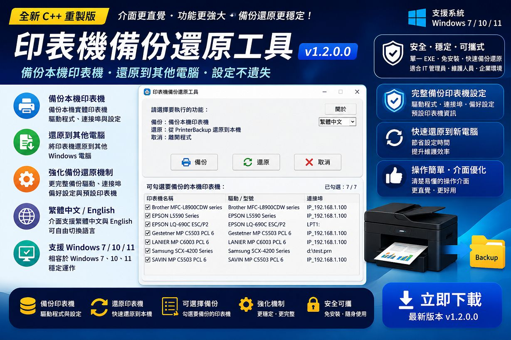
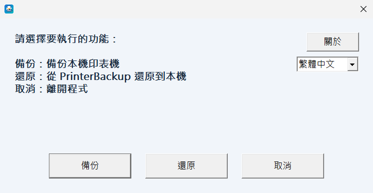
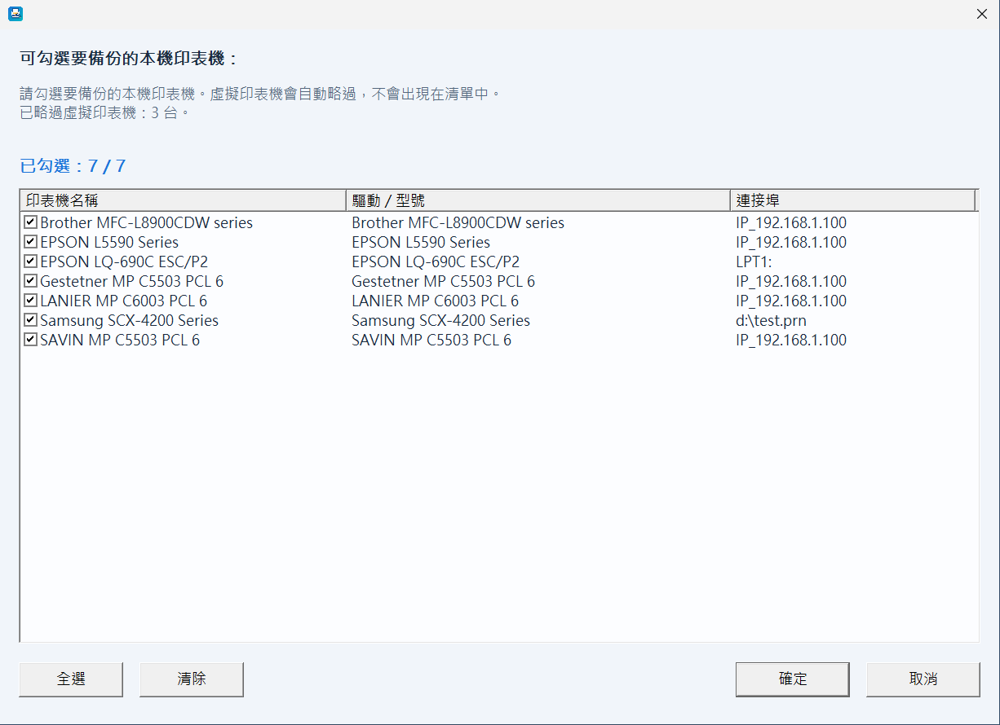

# Windows Printer Backup Restore

Lightweight Windows printer backup and restore utility for Windows 7 / 10 / 11.


[Releases](https://github.com/Terence0816/Windows-Printer-Backup-Restore/releases) |
[Latest Build v1.2.0.0](https://github.com/Terence0816/Windows-Printer-Backup-Restore/releases/tag/v1.2.0.0) |
[MIT License](LICENSE)

English | [繁體中文](#繁體中文)



Windows Printer Backup Restore is a lightweight **Windows printer backup and restore utility**.

It is designed for IT administrators, support engineers, MSP service providers, and users who need to back up local printers and restore them to another Windows computer.

Version `v1.2.0.0` is a major update rebuilt with native C++.  
This version improves the backup and restore workflow, adds a more intuitive graphical interface, supports Traditional Chinese / English language switching, and improves compatibility and stability for Windows 7 / 10 / 11.

## Version History

### v1.2.0.0

* Rebuilt Windows Printer Backup Restore with native C++.
* Improved the main graphical operation interface.
* Added Traditional Chinese / English language switching.
* Improved local printer backup workflow.
* Improved printer restore workflow.
* Added selectable local printer backup list.
* Improved printer name, driver / model, and port information display.
* Improved backup and restore stability.
* Improved handling of printer drivers, ports, printer preferences, and default printer information.
* Improved virtual printer filtering.
* Improved backup data detection and restore process.
* Supports Windows 7 / 10 / 11.

### v1.1.1.0

* Added three restore modes for shared `\\server\share` printers:
  * Original connection
  * Local Port
  * LPR Port
* Shared-printer restore installs the backed-up driver first before connecting or creating the printer.
* Improved shared-printer path handling.
* Improved Local Port and LPR Port restore flow.
* Released signed portable executable.

## Highlights

* Native C++ implementation
* Lightweight single executable
* No installation required
* Backup local physical printers
* Restore printers to another Windows computer
* Backup printer drivers
* Backup TCP/IP, USB, Local Port, and LPR Port information
* Backup printer preferences
* Restore printer preferences
* Restore the original default printer when possible
* Select which printers to back up or restore
* Display printer name, driver / model, and port information
* Skip common virtual printers automatically
* Traditional Chinese and English interface
* Designed for Windows 7 / 10 / 11

## How to Use

### 1. Run as Administrator

Run `PrtEasyBAK.exe` as **Administrator**.

Printer backup and restore operations may require administrator permission.

### 2. Choose an Operation

On the main screen, choose one of the following options:

* **Backup**: Backup local printers from this computer.
* **Restore**: Restore printers from the `PrinterBackup` folder to this computer.
* **Cancel**: Exit the program.

### 3. Backup Local Printers

When backing up printers, the tool lists available local physical printers.

Common virtual printers are automatically skipped and will not appear in the list.

You can select which printers to back up before starting the backup process.

The backup process stores printer-related information such as:

* Printer name
* Driver / model
* Port information
* Printer preferences
* Default printer information

### 4. Restore Printers

To restore printers on another computer:

1. Copy the whole `PrinterBackup` folder to the target computer.
2. Place the `PrinterBackup` folder next to `PrtEasyBAK.exe`.
3. Run `PrtEasyBAK.exe` as Administrator.
4. Choose **Restore**.
5. Select the printers you want to restore.
6. Confirm and start the restore process.

## Backup Folder

The tool creates and uses the following folder:

```text
PrinterBackup
```

Please keep the entire `PrinterBackup` folder when moving the backup to another computer.

## Supported Printer Information

The tool is designed to back up and restore as much printer information as possible, including:

* Printer drivers
* Printer ports
* TCP/IP printer port information
* USB printer port information
* Local Port information
* LPR Port information
* Printer preferences
* Default printer information

## Screenshots


### English Interface





## Download

* Release page: [Releases](https://github.com/Terence0816/Windows-Printer-Backup-Restore/releases)
* Latest build: [Windows Printer Backup Restore v1.2.0.0](https://github.com/Terence0816/Windows-Printer-Backup-Restore/releases/tag/v1.2.0.0)

Release assets usually include:

```text
PrtEasyBAK.exe
PrtEasyBAK.exe.sha256.txt
```

## SHA-256

```text
PrtEasyBAK.exe
342edbf44e721f13c4f2a20fefee82beb40f620a70d4267199cd58bf97a3fe4d
```

## Notes

* Please run this program as Administrator.
* Please test in your own environment before large-scale deployment.
* Some printer preferences may still depend on the printer driver version and Windows version.
* USB printers may still need to be reconnected or manually confirmed after restore.
* Network shared printers may require the original print server to remain available.
* Because this is a newly released executable, Windows Defender SmartScreen or antivirus software may show an uncommon app warning.
* Please download only from the official GitHub Releases page.

## Search Keywords

Windows printer backup, Windows printer restore, printer migration tool, printer backup restore, printer driver backup, printer port backup, printer preference backup, printer preference restore, PrinterBackup, TCP/IP printer backup, USB printer backup, Local Port printer, LPR Port printer, Windows 7 printer backup, Windows 10 printer backup, Windows 11 printer backup, MSP printer tool, IT printer maintenance

## Disclaimer

This software is provided as-is.

The author does not guarantee full compatibility with every printer, driver, or Windows environment.

Please use this tool only on computers you own or have permission to maintain.

## License

This repository is released under the MIT License. See [LICENSE](LICENSE).

---

# 繁體中文



Windows Printer Backup Restore 是一套輕量化的 **Windows 印表機備份與還原工具**。

本工具適合 IT 管理員、系統維護人員、MSP 維護商，以及需要將印表機設定從一台電腦移轉到另一台電腦的使用者。

`v1.2.0.0` 是一次較大的更新版本。  
本版已改用原生 C++ 全新重製，改善備份與還原流程，加入更直覺的圖形化操作介面，支援繁體中文 / English 介面切換，並提升 Windows 7 / 10 / 11 環境下的相容性與穩定度。

## 版本更新紀錄

### v1.2.0.0

* 使用原生 C++ 全新重製 Windows Printer Backup Restore。
* 改善主操作介面。
* 新增繁體中文 / English 介面切換。
* 改善本機印表機備份流程。
* 改善印表機還原流程。
* 新增可勾選的本機印表機備份清單。
* 改善印表機名稱、驅動 / 型號、連接埠資訊顯示。
* 強化備份與還原穩定度。
* 強化印表機驅動程式、連接埠、印表機偏好設定與預設印表機資訊處理。
* 改善虛擬印表機過濾。
* 改善備份資料偵測與還原流程。
* 支援 Windows 7 / 10 / 11。

### v1.1.1.0

* 共享印表機 `\\server\share` 還原時，新增三種模式可選：
  * 原始連接
  * Local Port
  * LPR Port
* 共享印表機還原前會先安裝備份的驅動程式，再進行後續連接或建立。
* 改善共享印表機的路徑解析。
* 調整 Local Port 與 LPR Port 的還原流程。
* 發布已簽章的可攜式執行檔。

## 功能特色

* 原生 C++ 實作
* 輕量化單一執行檔
* 無需安裝，可攜式工具
* 備份本機實體印表機
* 還原印表機到另一台 Windows 電腦
* 備份印表機驅動程式
* 備份 TCP/IP、USB、Local Port、LPR Port 連接埠資訊
* 備份印表機偏好設定
* 還原印表機偏好設定
* 可盡可能還原原本的預設印表機
* 可選擇要備份或還原的印表機
* 顯示印表機名稱、驅動 / 型號、連接埠資訊
* 自動略過常見虛擬印表機
* 支援繁體中文與英文介面
* 設計給 Windows 7 / 10 / 11 使用

## 使用方式

### 1. 使用系統管理員身分執行

請使用 **系統管理員身分** 執行 `PrtEasyBAK.exe`。

印表機備份與還原操作可能需要系統管理員權限。

### 2. 選擇要執行的功能

在主畫面選擇要執行的功能：

* **備份**：備份本機印表機。
* **還原**：從 `PrinterBackup` 還原到本機。
* **取消**：離開程式。

### 3. 備份本機印表機

進行備份時，工具會列出可備份的本機實體印表機。

常見虛擬印表機會自動略過，不會出現在清單中。

使用者可在備份前勾選要備份的印表機。

備份內容包含：

* 印表機名稱
* 驅動 / 型號
* 連接埠資訊
* 印表機偏好設定
* 預設印表機資訊

### 4. 還原印表機

若要將印表機還原到另一台電腦：

1. 將整個 `PrinterBackup` 資料夾複製到目標電腦。
2. 將 `PrinterBackup` 資料夾放在 `PrtEasyBAK.exe` 旁邊。
3. 使用系統管理員身分執行 `PrtEasyBAK.exe`。
4. 選擇 **還原**。
5. 勾選要還原的印表機。
6. 確認後開始還原。

## 備份資料夾

本工具會建立並使用下列資料夾：

```text
PrinterBackup
```

將備份資料移到其他電腦時，請保留整個 `PrinterBackup` 資料夾。

## 支援備份的印表機資訊

本工具會盡可能備份與還原下列印表機資訊：

* 印表機驅動程式
* 印表機連接埠
* TCP/IP 印表機連接埠資訊
* USB 印表機連接埠資訊
* Local Port 資訊
* LPR Port 資訊
* 印表機偏好設定
* 預設印表機資訊

## 畫面截圖

### 繁體中文介面





## 下載

* 發行版本頁面：[Releases](https://github.com/Terence0816/Windows-Printer-Backup-Restore/releases)
* 最新版本：[Windows Printer Backup Restore v1.2.0.0](https://github.com/Terence0816/Windows-Printer-Backup-Restore/releases/tag/v1.2.0.0)

Release assets 通常包含：

```text
PrtEasyBAK.exe
PrtEasyBAK.exe.sha256.txt
```

## SHA-256

```text
PrtEasyBAK.exe
342edbf44e721f13c4f2a20fefee82beb40f620a70d4267199cd58bf97a3fe4d
```

## 注意事項

* 請使用系統管理員身分執行本程式。
* 建議大量部署前，先於目標環境進行測試。
* 部分印表機偏好設定可能會受到驅動程式版本與 Windows 版本影響。
* USB 印表機還原後，可能仍需要重新插拔或手動確認 USB 連接埠。
* 網路共用印表機可能需要原始列印伺服器仍可連線。
* 因為這是新發行的執行檔，Windows Defender SmartScreen 或部分防毒軟體可能會顯示不常見程式提醒。
* 請只從官方 GitHub Releases 頁面下載。

## 搜尋關鍵字

Windows 印表機備份、Windows 印表機還原、印表機移機工具、印表機備份還原、印表機驅動備份、印表機連接埠備份、印表機偏好設定備份、印表機偏好設定還原、PrinterBackup、TCP/IP 印表機備份、USB 印表機備份、Local Port 印表機、LPR Port 印表機、Windows 7 印表機備份、Windows 10 印表機備份、Windows 11 印表機備份、MSP 印表機工具、IT 印表機維護

## 免責聲明

本工具依現況提供。

作者不保證所有印表機、驅動程式與 Windows 環境皆能完整相容。

請僅在您擁有或被授權維護的電腦上使用本工具。

## 授權

本專案使用 MIT License 授權。請參考 [LICENSE](LICENSE)。
